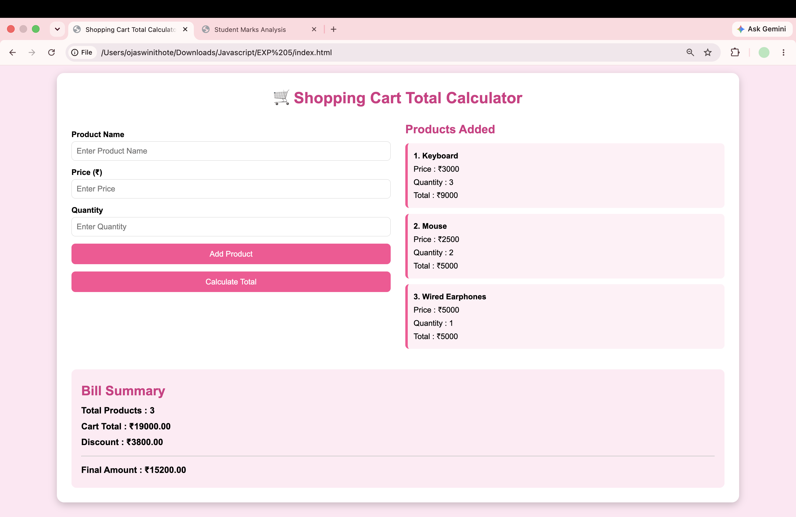

# Experiment No. 5

**Student Name:** Ojaswini Thote
**PRN:** 24070521048

---

## Experiment Title

**Apply array methods and object handling; create a cart total calculator with discount logic. **

---

## Software / Tools Required

1. Visual Studio Code
2. Google Chrome
3. HTML5
4. JavaScript (ES6)

---

# Task 5.1 — Shopping Cart Calculator

## Aim

Demonstrate JavaScript array methods — `forEach`, `map`, `filter`, and `reduce` — using a Shopping Cart Calculator with product objects.

## File Path

`file:///Users/ojaswinithote/Desktop/Javascript/EXP%205/Practical/index.html`

## Program Code

### `Task5/5.1/index.html`

```html
<!DOCTYPE html>
<html lang="en">
<head>
<meta charset="UTF-8">
<meta name="viewport" content="width=device-width, initial-scale=1.0">
<title>Shopping Cart Total Calculator</title>

<style>

*{
    margin:0;
    padding:0;
    box-sizing:border-box;
    font-family:Arial, Helvetica, sans-serif;
}

body{
    background:#ffe6f2;
    padding:30px;
}

.container{
    width:95%;
    max-width:1400px;
    margin:auto;
    background:white;
    border-radius:15px;
    box-shadow:0 5px 15px rgba(0,0,0,0.2);
    padding:30px;
}

h1{
    text-align:center;
    color:#d63384;
    margin-bottom:30px;
}

.main{
    display:flex;
    gap:30px;
    align-items:flex-start;
}

.left{
    flex:1;
}

.right{
    flex:1;
}

label{
    display:block;
    margin-top:15px;
    margin-bottom:5px;
    font-weight:bold;
}

input{
    width:100%;
    padding:10px;
    border:1px solid #ccc;
    border-radius:8px;
    font-size:16px;
}

button{
    width:100%;
    padding:12px;
    margin-top:15px;
    background:#ff4d94;
    color:white;
    border:none;
    border-radius:8px;
    cursor:pointer;
    font-size:16px;
}

button:hover{
    background:#e60073;
}

.right h2{
    color:#d63384;
    margin-bottom:15px;
}

.product{
    background:#fff0f6;
    border-left:5px solid #ff4d94;
    padding:12px;
    margin-bottom:12px;
    border-radius:8px;
    line-height:1.7;
}

#result{
    margin-top:30px;
    background:#ffeaf3;
    padding:20px;
    border-radius:10px;
    font-size:18px;
    line-height:1.8;
    font-weight:bold;
}

hr{
    margin:12px 0;
}

@media(max-width:900px){

.main{
    flex-direction:column;
}

}

</style>

</head>
<body>

<div class="container">

<h1>🛒 Shopping Cart Total Calculator</h1>

<div class="main">

<div class="left">

<label>Product Name</label>
<input type="text" id="productName" placeholder="Enter Product Name">

<label>Price (₹)</label>
<input type="number" id="price" placeholder="Enter Price">

<label>Quantity</label>
<input type="number" id="quantity" placeholder="Enter Quantity">

<button onclick="addProduct()">Add Product</button>

<button onclick="calculateBill()">Calculate Total</button>

</div>

<div class="right">

<h2>Products Added</h2>

<div id="productList">
<p>No products added.</p>
</div>

</div>

</div>

<div id="result"></div>

</div>

<script src="script.js"></script>

</body>
</html>
```

---

### `Task5/5.1/script.js`

```js
// Array to store product objects
const cart = [];

// Add Product
function addProduct(){

    const name = document.getElementById("productName").value.trim();
    const price = Number(document.getElementById("price").value);
    const quantity = Number(document.getElementById("quantity").value);

    if(name==="" || price<=0 || quantity<=0){
        alert("Please enter valid product details.");
        return;
    }

    // Object
    const product={
        name:name,
        price:price,
        quantity:quantity,
        total:price*quantity
    };

    // Array Method
    cart.push(product);

    displayProducts();

    document.getElementById("productName").value="";
    document.getElementById("price").value="";
    document.getElementById("quantity").value="";
}

// Display Products
function displayProducts(){

    const productList=document.getElementById("productList");

    productList.innerHTML="";

    cart.forEach(function(item,index){

        productList.innerHTML+=`
        <div class="product">
            <strong>${index+1}. ${item.name}</strong><br>
            Price : ₹${item.price}<br>
            Quantity : ${item.quantity}<br>
            Total : ₹${item.total}
        </div>
        `;

    });

}

// Calculate Bill
function calculateBill(){

    if(cart.length===0){
        alert("Cart is empty.");
        return;
    }

    // Array Method - reduce()
    const cartTotal=cart.reduce(function(sum,item){
        return sum+item.total;
    },0);

    let discount=0;

    if(cartTotal>=5000){
        discount=cartTotal*0.20;
    }
    else if(cartTotal>=3000){
        discount=cartTotal*0.15;
    }
    else if(cartTotal>=1000){
        discount=cartTotal*0.10;
    }

    const finalAmount=cartTotal-discount;

    document.getElementById("result").innerHTML=`
        <h2 style="color:#d63384;">Bill Summary</h2>
        Total Products : ${cart.length}<br>
        Cart Total : ₹${cartTotal.toFixed(2)}<br>
        Discount : ₹${discount.toFixed(2)}
        <hr>
        Final Amount : ₹${finalAmount.toFixed(2)}
    `;

}
```

---
## Array Methods Used

| Method      | Purpose                                                       |
| ----------- | ------------------------------------------------------------- |
| `forEach()` | Renders each cart item as a table row                         |
| `map()`     | Builds the Item Summary list with product name and item total |
| `filter()`  | Extracts products where `price > 1000`                        |
| `reduce()`  | Calculates the grand total: `sum + (price × quantity)`        |

---

## Output

* User enters **Product Name, Price, and Quantity** and clicks **Add Product**.
* The table displays **ID, Name, Price, Quantity, and Total** for each product.
* Discount is applied automatically:

  * **≥ ₹50,000 → 20% discount**
  * **≥ ₹20,000 → 10% discount**
  * **≥ ₹5,000 → 5% discount**
* **Final Amount = Total − Discount**
* Item Summary and Expensive Products lists are updated whenever a new product is added.

## Screenshot



---

# Task 5.2 — Max & Min Finder (Array of Objects)

## Aim

Create an array of objects from user input and find the Maximum and Minimum values using array methods — `map()`, `Math.max()`, `Math.min()`, and `some()`.

## File Path

`Task5/5.2/index.html`
`Task5/5.2/script.js`

## Program Code

### `Task5/5.2/index.html`

```html
<!DOCTYPE html>
<html lang="en">

<head>

<meta charset="UTF-8">
<meta name="viewport" content="width=device-width, initial-scale=1.0">

<title>Student Marks Analysis</title>

<style>

*{
    margin:0;
    padding:0;
    box-sizing:border-box;
    font-family:'Segoe UI',Tahoma,Geneva,Verdana,sans-serif;
}

body{
    min-height:100vh;
    padding:40px;
    background:linear-gradient(135deg,#4facfe,#00f2fe);
}

.container{
    width:95%;
    max-width:1100px;
    margin:auto;
    background:white;
    padding:40px;
    border-radius:20px;
    box-shadow:0 15px 40px rgba(0,0,0,.25);
}

h1{
    text-align:center;
    color:#0d47a1;
    margin-bottom:10px;
    font-size:34px;
}

.subtitle{
    text-align:center;
    color:#666;
    margin-bottom:35px;
}

.form-section{
    background:#f4f8ff;
    padding:25px;
    border-radius:15px;
    border-left:6px solid #1565c0;
}

.form-section h2{
    color:#0d47a1;
    margin-bottom:20px;
}

.input-row{
    display:flex;
    gap:20px;
}

.input-group{
    flex:1;
}

label{
    display:block;
    font-size:16px;
    font-weight:600;
    margin-bottom:8px;
    color:#333;
}

input{
    width:100%;
    padding:13px;
    border:2px solid #90caf9;
    border-radius:10px;
    font-size:16px;
    outline:none;
}

input:focus{
    border-color:#1565c0;
    box-shadow:0 0 8px rgba(21,101,192,.25);
}

button{
    padding:13px;
    border:none;
    border-radius:10px;
    background:linear-gradient(135deg,#1976d2,#0d47a1);
    color:white;
    font-size:16px;
    font-weight:bold;
    cursor:pointer;
    transition:.3s;
}

button:hover{
    transform:translateY(-2px);
    box-shadow:0 7px 15px rgba(13,71,161,.3);
}

.add-button{
    width:100%;
    margin-top:20px;
}

.operations{
    display:grid;
    grid-template-columns:1fr 1fr;
    gap:15px;
    margin-top:20px;
}

.operations button{
    width:100%;
}

.analyze{
    width:100%;
    margin-top:20px;
    background:linear-gradient(135deg,#43a047,#1b5e20);
}

.students-count{
    text-align:center;
    margin-top:20px;
    color:#555;
    font-size:16px;
}

.results{
    display:flex;
    gap:25px;
    margin-top:35px;
}

.card{
    flex:1;
    padding:30px;
    border-radius:15px;
    text-align:center;
    box-shadow:0 8px 20px rgba(0,0,0,.12);
}

.topper{
    background:linear-gradient(135deg,#fff8dc,#ffe082);
}

.lowest{
    background:linear-gradient(135deg,#ffebee,#ef9a9a);
}

.icon{
    font-size:50px;
    margin-bottom:10px;
}

.card h2{
    margin-bottom:15px;
}

.card h3{
    font-size:25px;
    margin-bottom:8px;
}

.card p{
    font-size:17px;
    margin:5px 0;
    color:#444;
}

.marks{
    font-size:32px !important;
    font-weight:bold;
    margin-top:15px !important;
}

#message{
    text-align:center;
    margin-top:20px;
    font-weight:bold;
    color:#1565c0;
}

@media(max-width:700px){

    body{
        padding:20px;
    }

    .container{
        width:100%;
        padding:25px;
    }

    .input-row{
        flex-direction:column;
    }

    .operations{
        grid-template-columns:1fr;
    }

    .results{
        flex-direction:column;
    }

}

</style>

</head>


<body>

<div class="container">

    <h1>Student Marks Analysis</h1>

    <p class="subtitle">
        Student Performance using Arrays, Objects and Array Methods
    </p>


    <div class="form-section">

        <h2>Enter Student Details</h2>


        <div class="input-row">

            <div class="input-group">

                <label for="name">
                    Student Name
                </label>

                <input
                    type="text"
                    id="name"
                    placeholder="Enter student name"
                >

            </div>


            <div class="input-group">

                <label for="prn">
                    PRN
                </label>

                <input
                    type="text"
                    id="prn"
                    placeholder="Enter PRN"
                >

            </div>


            <div class="input-group">

                <label for="marks">
                    Marks
                </label>

                <input
                    type="number"
                    id="marks"
                    placeholder="Enter marks"
                    min="0"
                    max="100"
                >

            </div>

        </div>


        <!-- PUSH -->

        <button class="add-button" onclick="addStudent()">
            Add Student (push)
        </button>


        <!-- POP, UNSHIFT, SHIFT -->

        <div class="operations">

            <button onclick="removeLastStudent()">
                Remove Last Student (pop)
            </button>

            <button onclick="removeFirstStudent()">
                Remove First Student (shift)
            </button>

            <button onclick="addFirstStudent()">
                Add Student at Beginning (unshift)
            </button>

            <button onclick="showCurrentArray()">
                Check Array in Console
            </button>

        </div>


        <button class="analyze" onclick="analyzeStudents()">
            Analyze Student Performance
        </button>


        <div class="students-count" id="studentCount">
            No students added yet.
        </div>

    </div>


    <!-- FINAL RESULTS ONLY -->

    <div class="results">

        <div class="card topper">

            <div class="icon">🏆</div>

            <h2>Topper</h2>

            <h3 id="topperName">---</h3>

            <p id="topperPRN">
                PRN: ---
            </p>

            <p class="marks" id="topperMarks">
                --- Marks
            </p>

        </div>


        <div class="card lowest">

            <div class="icon">📉</div>

            <h2>Lowest Marks</h2>

            <h3 id="lowestName">---</h3>

            <p id="lowestPRN">
                PRN: ---
            </p>

            <p class="marks" id="lowestMarks">
                --- Marks
            </p>

        </div>

    </div>


    <div id="message"></div>

</div>


<script src="script1.js"></script>

</body>

</html>
```

---

### `Task5/5.2/script.js`

```javascript
// ==========================================
// ARRAY OF STUDENT OBJECTS
// ==========================================

let students = [];


// ==========================================
// PUSH - ADD STUDENT
// ==========================================

function addStudent(){

    let name = document.getElementById("name").value.trim();
    let prn = document.getElementById("prn").value.trim();
    let marks = Number(document.getElementById("marks").value);

    let message = document.getElementById("message");


    if(name === "" || prn === "" || isNaN(marks)){

        message.textContent =
            "Please enter all student details.";

        return;
    }


    if(marks < 0 || marks > 100){

        message.textContent =
            "Marks must be between 0 and 100.";

        return;
    }


    // Create Student Object

    let student = {

        name: name,
        prn: prn,
        marks: marks

    };


    // PUSH
    students.push(student);


    console.log("PUSH() executed");
    console.log("Student added:", student);
    console.log("Current Array:", students);


    updateStudentCount();


    document.getElementById("name").value = "";
    document.getElementById("prn").value = "";
    document.getElementById("marks").value = "";

    message.textContent =
        "Student added successfully using push().";

}


// ==========================================
// POP - REMOVE LAST STUDENT
// ==========================================

function removeLastStudent(){

    if(students.length === 0){

        document.getElementById("message").textContent =
            "No students available.";

        return;
    }


    let removedStudent = students.pop();


    console.log("POP() executed");
    console.log("Removed Student:", removedStudent);
    console.log("Current Array:", students);


    updateStudentCount();


    document.getElementById("message").textContent =
        removedStudent.name +
        " removed using pop().";

}


// ==========================================
// UNSHIFT - ADD STUDENT AT BEGINNING
// ==========================================

function addFirstStudent(){

    let name = document.getElementById("name").value.trim();
    let prn = document.getElementById("prn").value.trim();
    let marks = Number(document.getElementById("marks").value);


    if(name === "" || prn === "" || isNaN(marks)){

        document.getElementById("message").textContent =
            "Enter student details first.";

        return;
    }


    if(marks < 0 || marks > 100){

        document.getElementById("message").textContent =
            "Marks must be between 0 and 100.";

        return;
    }


    let student = {

        name: name,
        prn: prn,
        marks: marks

    };


    // UNSHIFT

    students.unshift(student);


    console.log("UNSHIFT() executed");
    console.log("Student added at beginning:", student);
    console.log("Current Array:", students);


    updateStudentCount();


    document.getElementById("name").value = "";
    document.getElementById("prn").value = "";
    document.getElementById("marks").value = "";


    document.getElementById("message").textContent =
        "Student added at beginning using unshift().";

}


// ==========================================
// SHIFT - REMOVE FIRST STUDENT
// ==========================================

function removeFirstStudent(){

    if(students.length === 0){

        document.getElementById("message").textContent =
            "No students available.";

        return;
    }


    let removedStudent = students.shift();


    console.log("SHIFT() executed");
    console.log("Removed Student:", removedStudent);
    console.log("Current Array:", students);


    updateStudentCount();


    document.getElementById("message").textContent =
        removedStudent.name +
        " removed using shift().";

}


// ==========================================
// FOREACH
// ==========================================

function analyzeStudents(){

    if(students.length === 0){

        document.getElementById("message").textContent =
            "Please add students first.";

        return;
    }


    console.log("================================");
    console.log("ARRAY METHODS");
    console.log("================================");


    // ======================================
    // forEach()
    // ======================================

    console.log("forEach() executed:");

    students.forEach(function(student){

        console.log(
            student.name +
            " | " +
            student.prn +
            " | " +
            student.marks
        );

    });


    // ======================================
    // map()
    // ======================================

    let graceMarks = students.map(function(student){

        return {

            name: student.name,
            prn: student.prn,
            marks: student.marks + 5

        };

    });


    console.log("map() executed:");
    console.log("Grace Marks:", graceMarks);


    // ======================================
    // filter()
    // ======================================

    let passedStudents = students.filter(function(student){

        return student.marks >= 40;

    });


    console.log("filter() executed:");
    console.log("Passed Students:", passedStudents);


    // ======================================
    // reduce()
    // ======================================

    let totalMarks = students.reduce(function(total, student){

        return total + student.marks;

    }, 0);


    console.log("reduce() executed:");
    console.log("Total Marks:", totalMarks);


    // ======================================
    // AVERAGE
    // ======================================

    let average = totalMarks / students.length;


    console.log("Average Marks:", average);


    // ======================================
    // FIND HIGHEST MARKS
    // ======================================

    let highestMarks = Math.max(

        ...students.map(function(student){

            return student.marks;

        })

    );


    // ======================================
    // FIND LOWEST MARKS
    // ======================================

    let lowestMarks = Math.min(

        ...students.map(function(student){

            return student.marks;

        })

    );


    // ======================================
    // FIND TOPPER
    // ======================================

    let topper = students.find(function(student){

        return student.marks === highestMarks;

    });


    // ======================================
    // FIND LOWEST STUDENT
    // ======================================

    let lowestStudent = students.find(function(student){

        return student.marks === lowestMarks;

    });


    console.log("Topper:", topper);

    console.log("Lowest Marks Student:", lowestStudent);


    // ======================================
    // DISPLAY FINAL RESULTS
    // ======================================

    document.getElementById("topperName").textContent =
        topper.name;

    document.getElementById("topperPRN").textContent =
        "PRN: " + topper.prn;

    document.getElementById("topperMarks").textContent =
        topper.marks + " Marks";


    document.getElementById("lowestName").textContent =
        lowestStudent.name;

    document.getElementById("lowestPRN").textContent =
        "PRN: " + lowestStudent.prn;

    document.getElementById("lowestMarks").textContent =
        lowestStudent.marks + " Marks";


    document.getElementById("message").textContent =
        "Analysis completed successfully.";

}


// ==========================================
// DISPLAY ARRAY IN CONSOLE ONLY
// ==========================================

function showCurrentArray(){

    console.log("Current Student Array:");
    console.table(students);

    document.getElementById("message").textContent =
        "Current array displayed in browser console.";

}


// ==========================================
// UPDATE STUDENT COUNT
// ==========================================

function updateStudentCount(){

    document.getElementById("studentCount").textContent =
        students.length +
        " student(s) currently stored.";

}
```

---

## Array Methods Used

| Method       | Purpose                                                |
| ------------ | ------------------------------------------------------ |
| `map()`      | Converts input strings into an array of number objects |
| `map()`      | Extracts `value` from each object into a plain array   |
| `some()`     | Validates that no entry is `NaN`                       |
| `Math.max()` | Finds the largest number using the spread operator     |
| `Math.min()` | Finds the smallest number using the spread operator    |

---

## Output

* User enters comma-separated numbers.

**Example:**

```text
10, 25, 3, 47, 8
```

* Clicking **Find Max & Min** displays:

```text
Numbers Array: [10, 25, 3, 47, 8]
Maximum Value: 47
Minimum Value: 3
```

* Invalid input displays an error message in red.

## Screenshot


---

# Result / Conclusion

Both tasks were completed successfully.

* **Task 5.1** demonstrated `forEach()`, `map()`, `filter()`, and `reduce()` through a Shopping Cart Calculator that dynamically adds products, computes totals, applies discounts, and lists expensive products.

* **Task 5.2** demonstrated `map()`, `some()`, `Math.max()`, and `Math.min()` by converting user-entered comma-separated numbers into an array of objects and finding the maximum and minimum values.

Thus, the experiment successfully demonstrated the practical use of **JavaScript Array Methods and Object Handling** in web applications.

---
